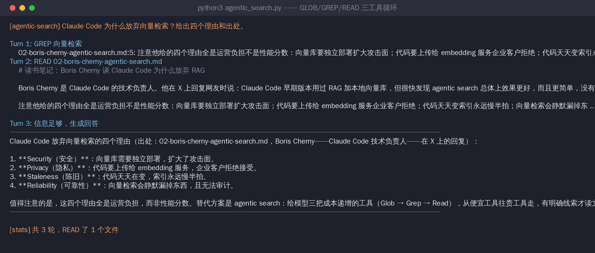

# Agentic Search 迷你实现 —— 150 行看懂 Claude Code 的检索姿态

没有 embedding、没有向量库、没有索引。给 LLM 三把成本递增的工具（GLOB → GREP → READ），让它自己决定怎么搜——这就是 Boris Cherny 说 Claude Code 用来替代 RAG 的方案，一个最小 agent loop 的完整复刻。纯标准库，零依赖。

## 跑起来

```bash
python3 agentic_search.py "Claude Code 为什么放弃向量检索？"
python3 agentic_search.py "问题" --corpus /你的文档目录
```

## 真实运行记录

三轮闭环：Turn 1 用 GREP（几百 token）直接命中关键行 → Turn 2 才 READ 整个文件（几千 token）→ Turn 3 给出带出处的回答。**从便宜工具往贵工具走，有明确线索才读文件**——这个成本纪律是 agentic search 的全部秘密：



## 复盘：好与不好

**好的部分：**

1. **三轮就答对了，READ 只花了 1 次**。GREP 先锁定文件，READ 才进去——如果第一步就 READ 所有文件，token 花销是这次的 5 倍。工具成本梯度真的在起作用。
2. **零预处理**。corpus 里的文档改一个字，下一次搜索立刻生效——没有索引要重建，这就是 Cherny 四个理由里 staleness 的正面。
3. **全程可审计**。哪轮用了什么工具、看了什么，终端里明明白白——向量检索"为什么没找到"说不清，这里每一步都能回放。

**不好的部分：**

1. **每次提问都全价重跑**。同一个问题问十遍，十遍都要走完整循环——没有任何沉淀。这正是 Karpathy 批评的 "rediscovering knowledge from scratch on every question"。
2. **关键词碰运气**。这次 GREP "向量检索" 一发命中是因为语料里用词一致；真实场景里问"embedding 索引"可能就搜不到写着"向量库"的文档——中文同义词发散比英文更严重，这是 grep 系检索的固有弱点（Cursor 坚持向量补充的理由）。
3. **循环需要护栏**。MAX_TURNS=8 这个上限必须有——测试中问一个语料里不存在答案的问题，LLM 会反复换关键词搜下去，没有上限就是 token 无底洞。
4. 输出指令偶尔不合法（解释性文字混进指令行），需要容错重试逻辑——agent loop 的鲁棒性成本在 demo 里都省不掉。

## 跟另外两条路的对照

同一份语料（`corpus/` 就是 `../llm-wiki/sources/` 的拷贝）、类似的问题：

| | 本实现（agentic search） | ../llm-wiki（per-source compile） |
|:--|:--|:--|
| 提问前的准备 | 零 | 编译 10 分钟、每篇 ~35K token |
| 单次提问 | 3 轮工具循环，全价 | 看目录 + 读 4 页，便宜 |
| 资料改了怎么办 | 立刻生效 | 旧页面会静默过时（lint 才能抓）|
| 问 100 次 | 100 次全价 | 编译成本已摊薄 |

两边的复盘放在一起读，三路选型那张决策表（见上级 README）就不再是抽象结论。
