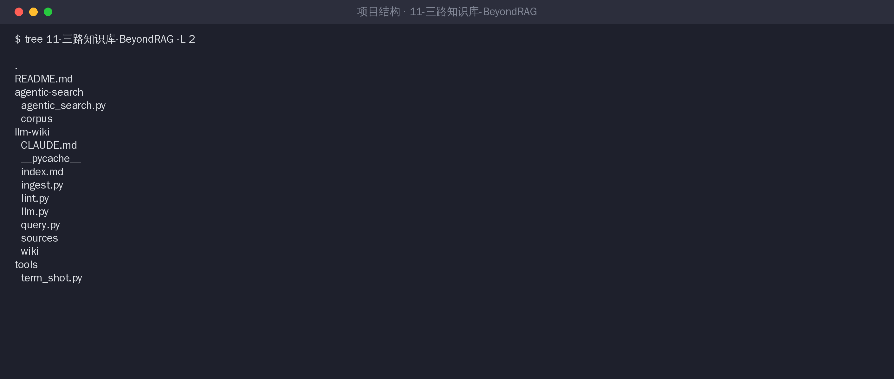
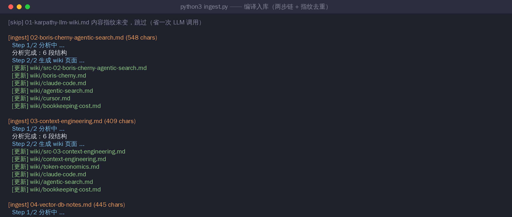
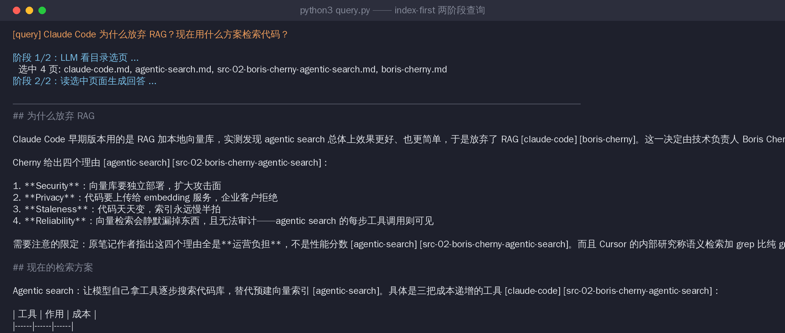
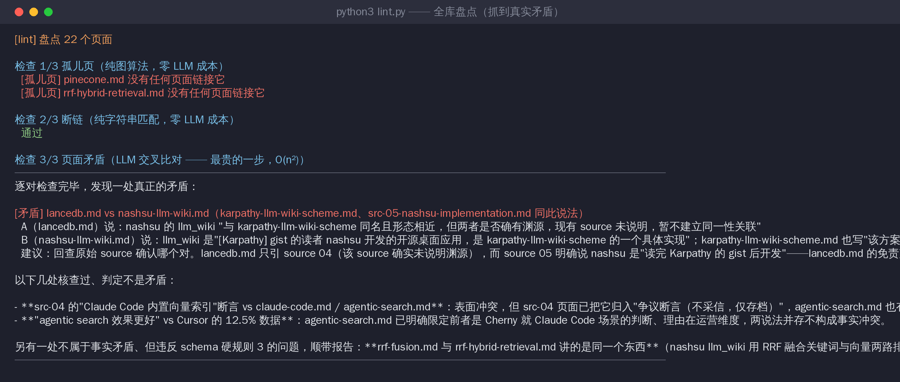
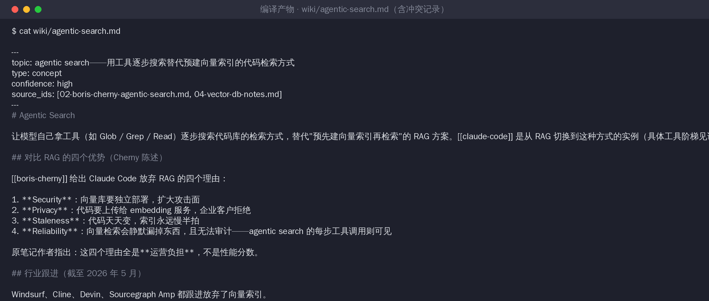

# LLM Wiki 迷你实现 —— Karpathy 方案的可运行复刻

Karpathy 2026 年 4 月的 LLM Knowledge Base 方案（gist: karpathy/442a6bf555914893e9891c11519de94f），三层三操作全实现。纯 Python 标准库，零 pip 依赖，LLM 调用走 `claude` CLI 子进程（可切 OpenAI，见 `llm.py`）。

## 结构



```
llm-wiki/
├── CLAUDE.md      # 第三层 Schema：教 LLM 怎么维护本库（编译器规格说明书）
├── sources/       # 第一层 Raw Sources：5 篇样例笔记，只进不改
├── wiki/          # 第二层 Wiki：LLM 编译产出（本目录 22 个页面全部真实生成）
├── index.md       # 全库轻量目录（query 阶段 1 只读它）
├── ingest.py      # 进货：两步编译链 + SHA-256 指纹去重
├── query.py       # 查货：index-first 两阶段查询
├── lint.py        # 盘点：孤儿页/断链（纯算法）+ 矛盾（LLM 交叉比对）
└── llm.py         # LLM 后端适配（claude CLI / OpenAI）
```

## 跑起来

```bash
python3 ingest.py                 # 编译 sources/ → wiki/（每篇约 2 次 LLM 调用）
python3 query.py "你的问题"       # 两阶段查询
python3 lint.py                   # 全库盘点
```

## 真实运行记录（三个操作全闭环）

**入库**：两步编译链跑通，每篇 source 触达 4-6 个 wiki 页面做交叉更新；第一行的 `[skip]` 是 SHA-256 指纹去重生效——重跑不花钱：



**查询**：阶段 1 LLM 看目录从 22 页里选中 4 页，阶段 2 生成带出处标注的回答。注意回答末尾主动转述了页面里的冲突记录：



**盘点**：孤儿页检查（零 LLM 成本）抓到 2 个；矛盾检查抓到一处**没有人为埋设的真实矛盾**（详见下面复盘第 2 条）：



**编译产物长这样**——`wiki/agentic-search.md`，注意"争议记录"一节，这是 ingest 阶段自动写下的：



## 实验设计说明

`sources/` 里埋了一个故意的矛盾：`02-boris-cherny-agentic-search.md` 说 Claude Code 放弃了向量库，`04-vector-db-notes.md` 末尾故意写了一句"Claude Code 内置了本地向量索引"（这句是假的）。目的是测试系统能不能抓到。

## 复盘：好与不好（真实观察，不是事后美化）

**好的部分：**

1. **埋的矛盾在 ingest 阶段就被抓到了**，根本没等到 lint。编译 doc-04 时，LLM 对照现有 wiki 发现新断言跟 Cherny 页面冲突，主动在 `agentic-search.md` 里写了争议记录，还做了裁决（无出处的断言不采信）。这正是 Karpathy 说的 "contradictions have already been surfaced"——结构编译一次，后续所有 query 免费享受这个裁决。
2. **lint 抓到了一个没人埋的真实矛盾**：`lancedb.md` 是编译 doc-04 时写的，里面有一句"nashsu 和 Karpathy 方案是否有渊源，source 未说明"；后来 doc-05 入库明确了渊源，但这个旧页面没被更新。这是"编译器缺失机制"里**没有增量重编译**的活体演示——一份新 source 进来，受影响的旧页面不会自动重编。教科书里的理论缺陷，在 22 页规模上就真实出现了。
3. SHA-256 指纹去重立竿见影：重跑 ingest，没变的文档一分钱不花。
4. 孤儿页/断链检查用纯图算法零成本——**规则能写清楚的不要给 LLM**，这条纪律直接省钱。

**不好的部分：**

1. **重复页面**：doc-05 入库时长出了 `rrf-fusion.md`，而 doc-04 时已经有 `rrf-hybrid-retrieval.md`，讲的是同一个东西，confidence 还不一致。原因是 schema 里"合并前必须确认是同一个东西"让 LLM 变保守，宁可新建不合并。合并判断是 LLM Wiki 最脆的一环。
2. **页面会静默过时**（上面好的第 2 条的反面）：好消息是 lint 能抓到，坏消息是矛盾检查是全库 O(n²) 的 LLM 比对，22 页还便宜，几百页之后这一步的成本会主导一切——千篇天花板不是理论，是账单。
3. **产出不稳定**：同样的 source 重跑一遍，页面划分会不同（有时 RRF 单独立页有时并进 hybrid-search）。LLM 编译不是确定性编译，diff-review 因此很重要。
4. 每篇 ingest 两次 LLM 调用约 1-2 分钟，5 篇串行跑了约 10 分钟——**并发 1 的队列在真实使用里体感很慢**，但共享可变状态下这是正确的取舍（nashsu 同款判断）。

一句话总结：**这套方案在百页规模真的好用，它的三个理论缺陷（不合并、不过期、不增量）也真的全部出现了**——两边都不是宣传，是运行记录。
